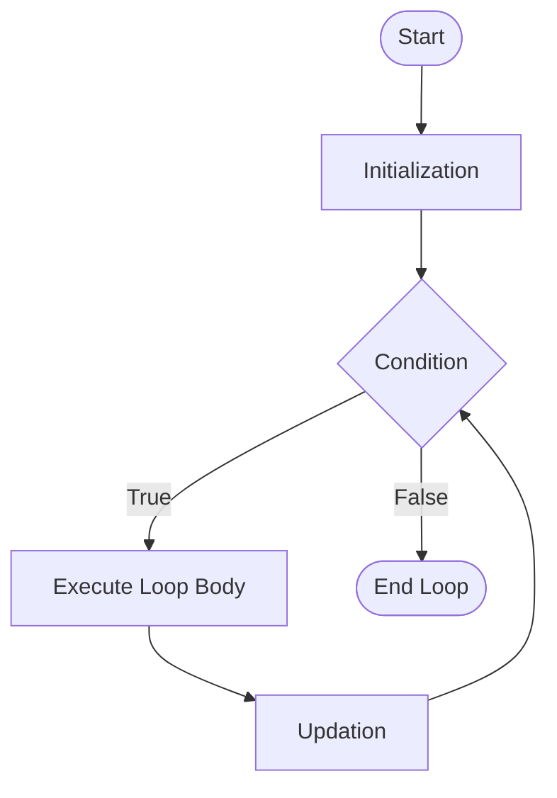

# Module 4: Loops & Control Flow (Java & DSA)

Welcome to **Module 4: Loops**. This section is a cornerstone of Data Structures and Algorithms. Mastering loops enables you to process arrays, navigate strings, construct patterns, and perform repetitive logic efficiently.

---

## 🎯 Theoretical Questions & Interview Prep

### **Level 1: The Basics (Junior / Fresher Level)**

**Q1: What is a loop? What are the types of loops in Java?**
- **Ans:** A loop is used to execute a block of code repeatedly based on a specific boolean condition. In Java, there are three primary loops: `for`, `while`, and `do-while`. A newer addition is the `for-each` loop (used mostly for collections/arrays).

**Q2: What is the difference between `while` and `do-while` loops?**
- **Ans:** 
  - **`while` loop:** It is an **entry-controlled loop**. The condition is checked *before* executing the loop body. If the condition is false initially, the loop body doesn't execute at all.
  - **`do-while` loop:** It is an **exit-controlled loop**. The loop body executes *at least once* before the condition is checked. 

**Q3: When should I use a `for` loop versus a `while` loop?**
- **Ans:** Use a **`for` loop** when you *know in advance* exactly how many times the loop should run (e.g., iterating through an array of fixed size). Use a **`while` loop** when you *don't know* how many times it will run, and the termination depends on a condition dynamically changing inside the loop (e.g., reading a file until the end).

### **Level 2: Intermediate (Logic & Syntax Tricks)**

**Q4: Can we initialize multiple variables in a `for` loop?**
- **Ans:** Yes, but they must be of the *same data type*.
  ```java
  for (int i = 0, j = 10; i < j; i++, j--) { ... } // Valid
  ```

**Q5: What happens if you omit the condition in a `for` loop? (`for(;;)`)**
- **Ans:** The condition defaults to `true`, resulting in an **infinite loop**. You must use a `break` statement inside the loop to terminate it.

**Q6: What is the difference between `break` and `continue`?**
- **Ans:** 
  - `break`: Completely **terminates** the loop and transfers execution to the statement immediately following the loop.
  - `continue`: **Skips** the remaining code in the *current iteration* and jumps to the updation/condition check for the next iteration.

### **Level 3: Pro / SDE-2 Level (Performance & Architecture)**

**Q7: Explain Loop Unrolling. Why is it used?**
- **Ans:** Loop unrolling is a performance optimization technique where the loop body is duplicated multiple times, and the loop control condition is modified to execute fewer iterations. 
  - **Why:** It reduces the overhead of the loop control instructions (checking the condition, incrementing the counter) and can improve instruction-level parallelism in modern CPUs.

**Q8: What is an `OutOfMemoryError` and how can an infinite loop cause it?**
- **Ans:** Normally, an infinite loop just consumes CPU (causing a hang). However, if your infinite loop *creates objects* (e.g., `list.add(new Object())`) without letting them be garbage collected, the heap memory will fill up, resulting in a `java.lang.OutOfMemoryError: Java heap space`.

---

## 🗺️ Flowcharts and Pseudocode

### 1. The `for` Loop Flow

**Pseudocode:**
```
FOR i FROM 1 TO N DO:
   PRINT i
END FOR
```

### 2. Check Prime Number (Optimized)
```mermaid
graph TD;
    Start([Start]) --> Input[Input N]
    Input --> C1{N <= 1?}
    C1 -- Yes --> P1[Not Prime] --> End([End])
    C1 -- No --> Init[i = 2]
    Init --> LoopC{i <= sqrt(N)?}
    LoopC -- Yes --> CheckDiv{N % i == 0?}
    CheckDiv -- Yes --> P2[Not Prime] --> End
    CheckDiv -- No --> Update[i++] --> LoopC
    LoopC -- No --> P3[Prime] --> End
```

---

## 💻 LeetCode Integration (15 Problems Solved)

I have created a dedicated `LeetCode_Practice` directory containing **15 meticulously solved LeetCode problems**. Each file contains the complete problem statement, constraints, time/space complexity analysis, and the optimized Java code.

Here is the master list of all 15 problems you will find in the `LeetCode_Practice` folder:

1. **[LeetCode 7: Reverse Integer](LeetCode_Practice/LC_007_ReverseInteger.java)** (Medium) - Handling overflow constraints with a `while` loop.
2. **[LeetCode 9: Palindrome Number](LeetCode_Practice/LC_009_PalindromeNumber.java)** (Easy) - Mathematical reversing without strings using `O(1)` space.
3. **[LeetCode 50: Pow(x, n)](LeetCode_Practice/LC_050_PowXN.java)** (Medium) - Binary Exponentiation using an optimized loop `O(log n)`.
4. **[LeetCode 69: Sqrt(x)](LeetCode_Practice/LC_069_SqrtX.java)** (Easy) - Binary search within a `while` loop.
5. **[LeetCode 70: Climbing Stairs](LeetCode_Practice/LC_070_ClimbingStairs.java)** (Easy) - Fibonacci series implemented via an iterative loop.
6. **[LeetCode 191: Number of 1 Bits](LeetCode_Practice/LC_191_NumberOf1Bits.java)** (Easy) - Bitwise AND loop (`n & (n-1)`).
7. **[LeetCode 202: Happy Number](LeetCode_Practice/LC_202_HappyNumber.java)** (Easy) - Cycle detection (slow/fast pointers) using nested loops.
8. **[LeetCode 231: Power of Two](LeetCode_Practice/LC_231_PowerOfTwo.java)** (Easy) - Modulo division loop.
9. **[LeetCode 258: Add Digits](LeetCode_Practice/LC_258_AddDigits.java)** (Easy) - Double nested `while` loops for digit summing.
10. **[LeetCode 326: Power of Three](LeetCode_Practice/LC_326_PowerOfThree.java)** (Easy) - Division looping.
11. **[LeetCode 412: Fizz Buzz](LeetCode_Practice/LC_412_FizzBuzz.java)** (Easy) - Standard `for` loop with multiple conditionals.
12. **[LeetCode 509: Fibonacci Number](LeetCode_Practice/LC_509_FibonacciNumber.java)** (Easy) - State tracking using previous variables in a loop.
13. **[LeetCode 1281: Subtract the Product and Sum of Digits of an Integer](LeetCode_Practice/LC_1281_SubtractProductAndSum.java)** (Easy) - Classic digit extraction loop.
14. **[LeetCode 1492: The kth Factor of n](LeetCode_Practice/LC_1492_KthFactorOfN.java)** (Medium) - Single iteration optimization to find factors.
15. **[LeetCode 1523: Count Odd Numbers in an Interval Range](LeetCode_Practice/LC_1523_CountOddNumbers.java)** (Easy) - Math overriding looping to avoid Time Limit Exceeded (TLE).

> [!TIP]
> **Don't Forget the Missed Concept!** I have also added `Ch10_Labeled_Break_Continue.java` in the main folder to teach you how to break/continue **outer loops** from inside nested inner loops! This is a highly requested tricky interview question.
